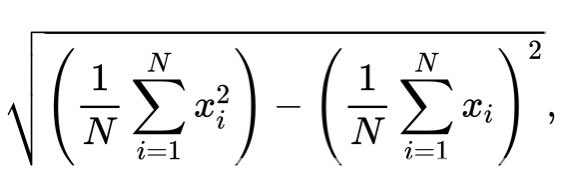

# Monoids with Property-Based Testing

By [Cyrille Martraire](https://twitter.com/cyriux) & [Mathieu Eveillard](https://twitter.com/meveillard)

## Part I: problem statement

Consider a simple stock management domain, with similar goods (items, or [SKUs](https://www.google.com/search?rlz=1C5CHFA_enFR832FR832&sxsrf=ALeKk01stmqJTaDQCEC9TvJAM3iyBMYaPQ%3A1611047315147&ei=k6EGYO27CIiXlwS8yY2ABg&q=stock-keeping+unit&oq=stock-keeping+unit&gs_lcp=CgZwc3ktYWIQAzIKCAAQyQMQFBCHAjICCAAyBggAEBYQHjIGCAAQFhAeMgYIABAWEB4yBggAEBYQHjIGCAAQFhAeMgYIABAWEB4yBggAEBYQHjIGCAAQFhAeOgQIABBHUMOWAVjDlgFgmpgBaABwBHgAgAFFiAFFkgEBMZgBAKABAqABAaoBB2d3cy13aXrIAQjAAQE&sclient=psy-ab&ved=0ahUKEwit0b330qfuAhWIy4UKHbxkA2AQ4dUDCA0&uact=5)) in multiple warehouses.

For a given item to be ordered, its stock across 2 warehouses is the sum of its stocks in each warehouse:

```java
assertEquals(new Stock(50), new Stock(20).combine(new Stock(30)));
```

Let's make that into one simple unit test on some hardcoded example values:

```java
@Test
public void theTotalStockIsTheSumOfEachStocks() {
  assertEquals(new Stock(50), new Stock(20).combine(new Stock(30)));
}
```

### YOUR TASK: make this test pass by creating the simplest Stock class (constructor, equals, hashcode and toString for our own convenience)

If we generalize the previous assertion we can define an interesting property called the Closure of the Operation in the DDD book: "The type method signatures are all about the type itself as parameters and return types, and nothing else but primitives".

Another way to express that property is "given any 2 values (instances) of the type, combining them still gives us an instance of that type". Let's make this property explicit in another dedicated automated test, using random values (instances):

```java
@Test
public void closureOfOperation() {
  final Stock a = forAnyStock();
  final Stock b = forAnyStock();
  assertTrue(a.combine(b) instanceof Stock);
}

private final static Stock forAnyStock() {
  return new Stock((int) (Math.random() * 100)); // stock from 0 to 100
}
```

Verifying that this holds true for every possible value is mostly the job of the compiler here, unless the operation can throw exceptions, hence the test, which also acts as a documentation here.

Turns out that the stock of zero quantity doesn't change the result when added to any other stock a: **a + 0 = a**.

### YOUR TASK: write that as an automated test ("for any value of stock, combining it with the stock zero gives the same stock")

```java
final Stock a = forAnyStock();
assertEquals(a, a.combine(new Stock(0)));
```

This is another interesting property of the special element new Stock(0) that is called the NEUTRAL element. We can make it explicit by introducing this element as a constant and by naming this automated test accordingly:

```java
@Test
public void neutralElement() {
  final Stock a = forAnyStock();
  assertEquals(a, a.combine(Stock.NEUTRAL)); // combine right
  assertEquals(a, Stock.NEUTRAL.combine(a)); // combine left
}
```

Lastly, it doesn't matter how we combine the various stocks together, since obviously **for any a, b, c, then a + (b + c) = (a + b) + c**.

### YOUR TASK: again, let's verify that by writing an automated test

```java
final Stock a = forAnyStock();
final Stock b = forAnyStock();
final Stock c = forAnyStock();
assertEquals(a.combine(b).combine(c), a.combine(b.combine(c)));
```

This property doesn't look that exciting, but it is. In practice it means that one could precompute partial results **arbitrarily** within the multiple cells of the warehouses or across regions or countries and then **still be able to derive the correct result** from them all. This property is called **associativity** and is fundamental for everything data-intensive (think map-reduce). Let's now rename the test accordingly:

```java
@Test
public void associativity() {
  final Stock a = forAnyStock();
  final Stock b = forAnyStock();
  final Stock c = forAnyStock();
  assertEquals(a.combine(b).combine(c), a.combine(b.combine(c)));
}
```

So what do we have now? We have one simple class that works with one method and a special value that together verify the properties:

- Closure of operations
- Neutral element
- Associativity

And we know these properties really hold because we have automated tests that continously verify them for any value, using randomness. The more you run the tests, the more diverse values are tested, so yo gain confidence.

### Congratulations! You've just re-created a monoid and a property-based testing tool all by yourself

Of course our example is very minimal, in two ways:

1. **Trival Monoid example**: The class considered is so trivial we don't see much benefits of monoids so far; expanding the business into more complicated behavior would exhibit the benfits more visibly.
1. **Poor-Man PBT Tooling**: The randomness in the tests is managed by hand, only one case at a time, the tests don't strictly conform to what "unit tests" should be, so it's all a very limited form of property-based testing; Moving to specialized PBT tools offer the convenience of more readable code, testing multiple cases on each run, and would feature the very nice "shrinking" capability to better interpret what's happening whenever a property is not verified for some values.

In the following steps we can explore and expand both directions (more complicated domain behavior, or/hand using PBT tools) at your wish. Feel free to jump directly to Part III if you're not interested or don't want to spend too much time right now in part II.

## Part II: further steps into using serious PBT tools

PBT being a well established testing practice, libraries exist in each mainstream environment:


- [Java](https://github.com/cyriux/java-kata-starter-pbt) using JUnitQuickcheck: https://github.com/pholser/junit-quickcheck (but feel free to use an alternative PBT tool
- [JS/TS](https://github.com/mathieueveillard/js-kata-starter-pbt)
- [Python](https://github.com/mathieueveillard/py-kata-starter-pbt)


Pick the proper setup and refactor your tests!

## Part III: further steps into more interesting monoids

**Without changing any of the 3 existing property tests**, enrich the domain with the following features. Think "how can I turn this into a monoid?". You may still add regular unit tests, or duplicate the 3 property tests for each new class you may introduce.

1. keep track of the minimal stock across all combined stocks
2. keep track of the average stock (and standard deviation of the stock) across all the combined stocks (\*)
3. manage more than one item, by having stocks of multiple items; You may want to start with just two items as an intermediate step

(\*) For this, you'll want to use the following formula of standard deviation:



## Monoids explained with pancakes

[Slides](https://docs.google.com/presentation/d/1EvMZesAipzA9M7qBxKDMigYUfGv9Ny78FffeyO9hMng/edit?usp=sharing)

## Some possible implementations

- [In Java, by @cyriux](https://github.com/cyriux/monoids-with-PBT-java)
- [In JS/TS, by @mathieueveillard](https://github.com/mathieueveillard/monoids-with-pbt)

## Further reading

As part of a great series on PBT, very extensive material:
https://blog.johanneslink.net/2018/07/16/patterns-to-find-properties/

To start PBT using JUnitQuickCheck, these two blog posts from Kenny are precise and useful: https://baasie.com/2017/05/03/property-based-testing-in-java-with-junit-quickcheck-part-1-the-basics

